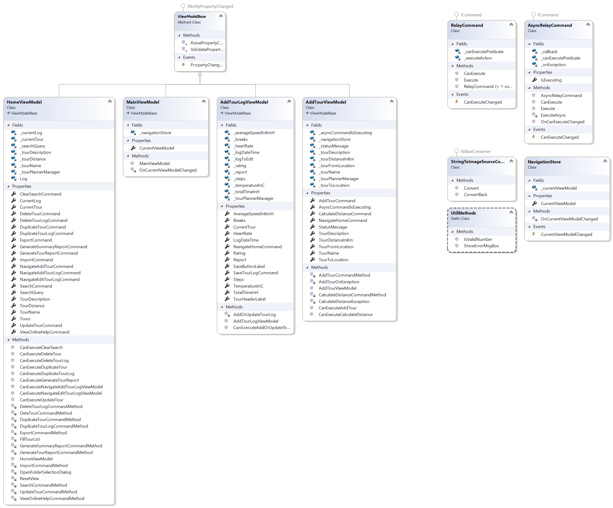

# WpfTourPlanner Documentation

## Table of Contents
- [Table of contents](#table-of-contents)
- [Architecture](#architecture)
    * [WpfTourPlanner](#wpftourplanner)
    * [WpfTourPlanner.BusinessLayer](#wpftourplannerbusinesslayer)
    * [WpfTourPlanner.DatAccessLayer](#wpftourplannerdataccesslayer)
    * [WpfTourPlannerDataAccessLayer.PostgressSqlServer](#wpftourplannerdataaccesslayerpostgresssqlserver)
    * [WpfTourPlanner.Models](#wpftourplannermodels)
    * [WpfTourPlanner.Package](#wpftourplannerpackage)
    * [WpfTourPlanner.Test](#wpftourplannertest)
- [UX / library decisions](#ux--library-decisions)
    * [PDF generation](#pdf-generation)
    * [JSON](#json)
    * [Logging](#logging)
    * [Additional WPF Dialog](#additional-wpf-dialog)
    * [UX](#ux)
- [Design pattern](#design-pattern)
- [Unique feature](#unique-feature)
- [Initial Setup Guide](#initial-setup-guide)
    * [App.config elements](#appconfig-elements)
- [Time Tracking](#time-tracking)

## Architecture
The Application has a layer based architecture: user interface - business logic - data access. The division into those three layers enables the possibility to easily exchange and modify layers. For example if a terminal "UI" is needed in the future all the other layers could be reused and only the UI layer would need to be changed / newly developed. Another example is if the requirement of a different data access method arises. This layered architecture enables the possibility of easily swapping out the PostgreSQL data access layer for a e.g. SQLite data access layer. \
The Solution contains 7 projects:
* [WpfTourPlanner](#wpftourplanner)
* [WpfTourPlanner.BusinessLayer](#wpftourplannerbusinesslayer)
* [WpfTourPlanner.DatAccessLayer](#wpftourplannerdataccesslayer)
* [WpfTourPlannerDataAccessLayer.PostgressSqlServer](#wpftourplannerdataaccesslayerpostgresssqlserver)
* [WpfTourPlanner.Models](#wpftourplannermodels)
* [WpfTourPlanner.Package](#wpftourplannerpackage)
* [WpfTourPlanner.Test](#wpftourplannertest)

### WpfTourPlanner
UI layer, WPF project containing views and view models. \
A Converter has been implemented that converts the filepath of an image to a Bitmap. So the file is not in use. This is required to delete the current tour. Otherwise the image would be in use and cannot be deleted. The current view model is stored in a seperate class (`NavigationStore`). Depending on which view model is currently selected different views (user controls) are displayed.

### WpfTourPlanner.BusinessLayer
Business logic layer, class library containing the business logic.
File handling (saving deleting and copying of images) was implemented in the business layer and not in the dal, because it would require an entirely new data access layer (file access) and that would result in too much overhead. Since the business layer often just calls methods from the DAL and does not add any functionality I decided to implement the file handling logic into the business layer. The factory returns an instance of the class `TourPlannermangerImpl`. Methods that call the MapQuest API (`Create Tour` and `GetTourDistance`) are async to hinder the UI from blocking when a request is sent. As import and export file format JSON was chosen. The images are not exported into the JSON file, the user must manually copy the images in order to export them. It is possible to import the exported JSON file without deleting the tours, however then the images are used by two tours and when deleting one tour the other tour has no image. This could be solved by including the image in the exported file (e.g. base64 encoded).

### WpfTourPlanner.DatAccessLayer
Abstract data access layer provides interfaces for the DAL also provides the factory that creates the DAL implementation.

### WpfTourPlannerDataAccessLayer.PostgressSqlServer
PostgreSQL implementation of the DAL.

### WpfTourPlanner.Models
Containing the Models and Exceptions used by all layers.
The following (5) additional properties were defined:
* Average Speed in km/h
* Temperature in °C
* Average heart rate in bpm
* Steps
* Breaks

### WpfTourPlanner.Package
Windows Application Package Project to publish the MSIX installer.

### WpfTourPlanner.Test
NUnit Test Project for unit tests.
Input validation tests are used to ensure that the parameters parsed to the BL and later to the DAL are indeed valid.
Assertion that specific exception is thrown are to validate the behaviour on wrong input / incorrect usage. \
Logic tests to ensure that essential parts of the business logic are working as expected (e.g. search function).

The following components were tested:
* Business Layer
  * Search for name
  * Search for description
  * Search for tourlog content
  * Invalid import file
* Model
  * assure that the rating is always between min and max value (0-1)
* PostgessSQL DAL
  * Declare Parameter
  * Assure that declaring an existing parameter throws an exception
  * Set Parameter
  * Assure tha setting an undeclared parameter throws an exception
  * Assure that GetTours throws an exception when an invalid connection string is provided
* View Models
  * Input validation tests (CanExecute... methods are tested)

## UX / library decisions
### PDF generation
**[QuestPDF](https://www.questpdf.com/)** was chosen because it is open source and seemed easy to use. Other pdf creation libraries were either not open source or seemed more complicated to get started with.
### JSON
**[Newtonsoft JSON](https://www.newtonsoft.com/json)**  the way to go when it comes to json in .NET.
### Logging
**[log4net](https://logging.apache.org/log4net/)**  was chosen because I found a guide to get started with log4net and it seemed easy and worked out of the box. \
Every exception is logged as an error, other useful information that might come in handy when trying to identify errors is logged as info. All methods in the database class with the statements and parameters are logged as debug.
### Additional WPF Dialog
**[Ookii.Dialogs.Wpf](https://github.com/ookii-dialogs/ookii-dialogs-wpf)** \
I do not like the default Windows 10 folder browser dialog so used this library to use the old folder explorer
### UX
Regarding UX emojis were used to emphasize the function of a button (e.g. 💾 for save)

## Design pattern
Factory design pattern: [Refactoring Guru](https://refactoring.guru/design-patterns/factory-method)
Factories were used to get instances of the respective layers. There is one Factory that returns a business layer implementation and one factory that returns an instance of the implementation. For this project the data access layer and business could have also been a Singleton, however the factory pattern enables the possibility to add additional data access or business layers that then can easily be swapped by providing different parameters to the factory.

## Unique feature
CI/CD Pipeline using GitHub Actions.
As a unique feature I chose to setup a continues integration and delivery pipeline using GitHub Actions. I wanted to create automatic Releases (compiled binaries) when pushing a new tag to the git repo. Furthermore unit tests should also be executed automatically. With a Windows application package a msix installer is compiled and provided as a zip folder to download. The application is released for both x86 and x64 systems. However due to a bug in .NET 5 and the MSIX packaging tool continues integration (automatic execution of unit tests and creating a msix installer in with Debug configuration) only works for x86, but this is not that big of an issue since x64 platforms can execute x86 applications. For further details regarding this bug see:\
Fixed but not released yet: [.NET 5 MSB4044 GitHub Issue](https://github.com/dotnet/sdk/issues/18031) \
No answer yet: [MSIX GitHub Issue regarding MSB4044 error](https://github.com/microsoft/MSIX-PackageSupportFramework/issues/180) \
For more information on how to setup GH Actions for a WPF App see [this example from Microsoft](https://github.com/microsoft/github-actions-for-desktop-apps)

## Initial Setup Guide
1. Clone the Project: (`git clone https://github.com/cellularegg/WpfTourPlanner.git`)
1. Setup PostgreSQL Database (I would recommend using Docker [postges docker image](https://hub.docker.com/_/postgres/))
1. Create a database for the tour planner and create the tables Tour and TourLog ([create scripts](https://github.com/cellularegg/WpfTourPlanner/tree/main/scripts))
1. Edit the App.config (located in [./WpfTourPlanner/App.config](https://github.com/cellularegg/WpfTourPlanner/blob/main/WpfTourPlanner/App.config) to according to your configuration
1. Add the MapQuest API key to your user environment variables with the key defined in the App.config
1. Now you should be able to use the tour planner

Note that the UPW App can only use the configuration provided by the App.config in the GitHub repo. If you wish to test the installed version, your setup must be compatible with the default configuration.

### App.config elements
In the App.config all settings are stored. The following keys are expected under `<appSettings>`:
* "**DalSqlAsselmbly**" The Assembly name of the data access layer which is loaded using reflection
* "**ExportFileName**" The file name of the export file (a .json file)
* "**SummaryReportFileName**" The file name of the summary report including all tours
* "**WorkingDirectory**" The directory where the images of newly created tours are saved
* "**MapQuestEnvironmentVarName**" The environment variable name of the environment variable containing the MapQuest API key. The API key is stored as an environment variable so I can release working UWP Apps while keeping my API key a secret. 

Additionally configuration for log4net see [official documentation](https://logging.apache.org/log4net/release/manual/configuration.html)

## Time Tracking
Time Tracking:
| Date      | time in h | Note                                                                         |
| --        | --        | --                                                                           |
| 7-mar-21  | 2         | Hello World in WPF                                                           |
| 19-mar-21 | 2         | Design thoughs / understanding MVVM                                          |
| 21-mar-21 | 2         | DAL PoC                                                                      |
| 22-mar-21 | 2         | Created UI without bindings                                                  |
| 14-may-21 | 4         | Wpf + layer tutorial                                                         |
| 15-may-21 | 9         | CI/CD Pipeline                                                               |
| 16-may-21 | 6         | CI/CD Pipeline                                                               |
| 17-may-21 | 3         | started from scrath with propper architecture                                |
| 18-may-21 | 3         | Added first bindings to UI                                                   |
| 19-may-21 | 3         | custom UI component                                                          |
| 19-may-21 | 4         | Added bindings for text fields in UI                                         |
| 19-may-21 | 3         | Added copy feature for tours and logs                                        |
| 20-may-21 | 3         | Added update tour and delete tour(log) feature                               |
| 23-may-21 | 1.5       | Added import and export feature                                              |
| 23-may-21 | 1.5       | Added fulltext search                                                        |
| 24-may-21 | 3         | Added report generation                                                      |
| 01-jun-21 | 3         | Added Unit Tests                                                             |
| 03-jun-21 | 1.5       | Added copy and delete for Images                                             |
| 03-jun-21 | 2         | Added basic navigation                                                       |
| 04-jun-21 | 7         | Added Create and edit of TourLog functionality + fixed Image deletion        |
| 05-jun-21 | 5         | Added create tour feature + async api call to mapquest api                   |
| 05-jun-21 | 4         | Fixed msix installer (by including app.config in repo) + wrote documentation |
| 06-jun-21 | 6         | Added logging + documentation                                                |
| 07-jun-21 | 4        | finalized logging + documentation                                            |

**Total time about 84.5 h**